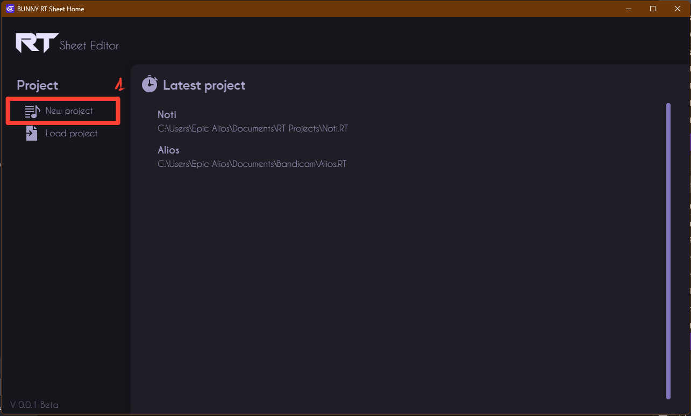
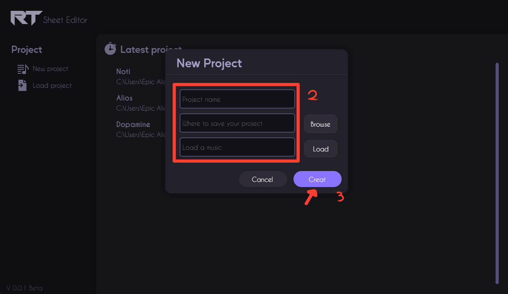

# Getting Started with RT Sheet Editor

## Step 1: Install RT Sheet Editor

RT Sheet Editor is available for all major operating systems, including the latest versions of Windows, macOS, and Linux. To download RT Sheet Editor

The installation instructions depend on the operating system.

**Windows:**

Double-click on the executable.
Click on the Next button several times, until the installation begins. This installs RT Sheet Editor, launches the app, and adds an icon to the Desktop.

**macOS:**

Open the DMG file.

**Linux (AppImage):**

Open a terminal.
Make the AppImage file executable by typing .chmod a+x RT-Sheet-Editor*.AppImage

## Step 2: Create a new project

1. Launch RT Sheet Editor.

2. Either click on **New project** to start from an empty project.

3. Choose a location and name for the project, and audio file to start a new project.

