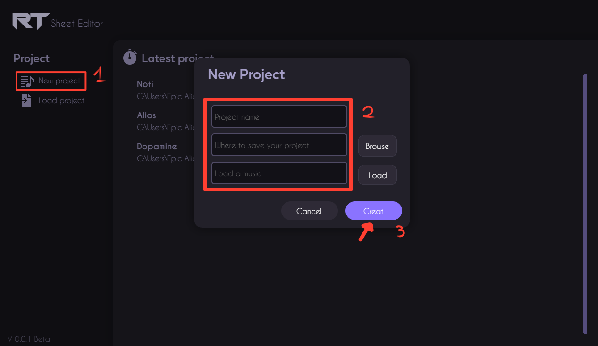
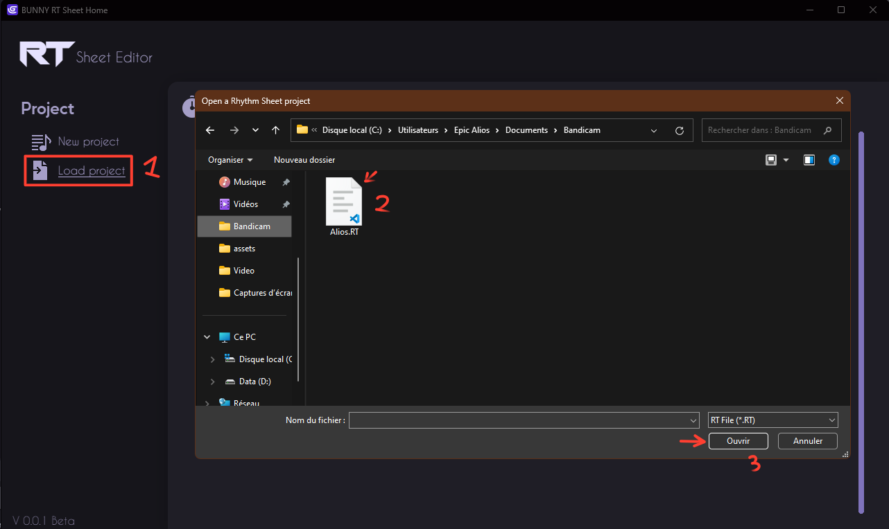
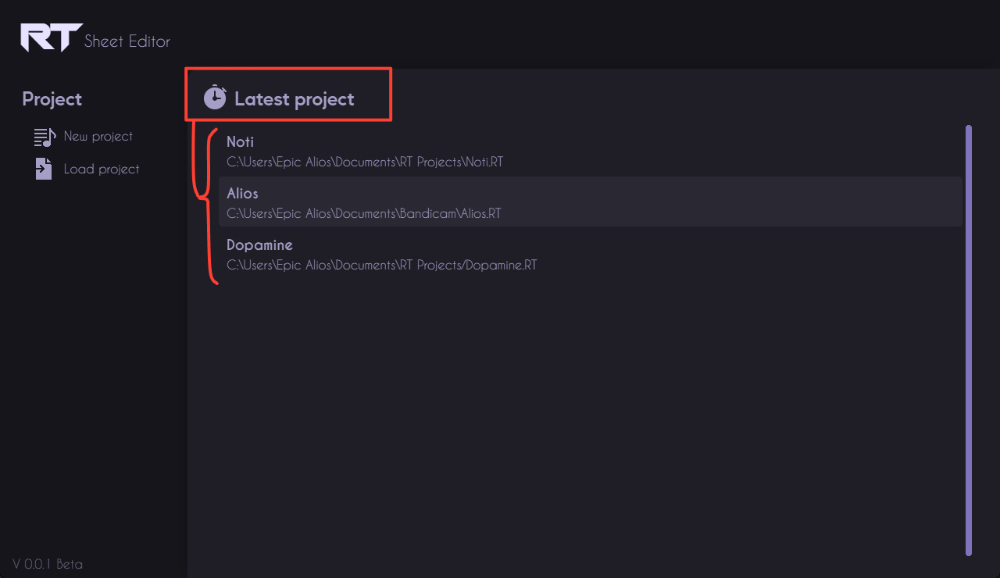

# Home page

## Create a new project.

Start creating your new project. (Use the cursor) 
- Click on "New project".
- A panel opens, asking you to fill in the various details of your project.
- Finally, click on "Create".

## Load an existing project.

Return to previous projects and continue working on your creations. Easily load existing projects to make changes or add new elements.To do this:
- Click on "Load project".
- A dialog window will open, allowing you to select the project.
- Finally, click on "Ouvrir" ("Open") :satisfied:

## Continue a recently opened project.

Get quick access to the projects you've recently worked on with the recent projects list. Pick up where you left off.

