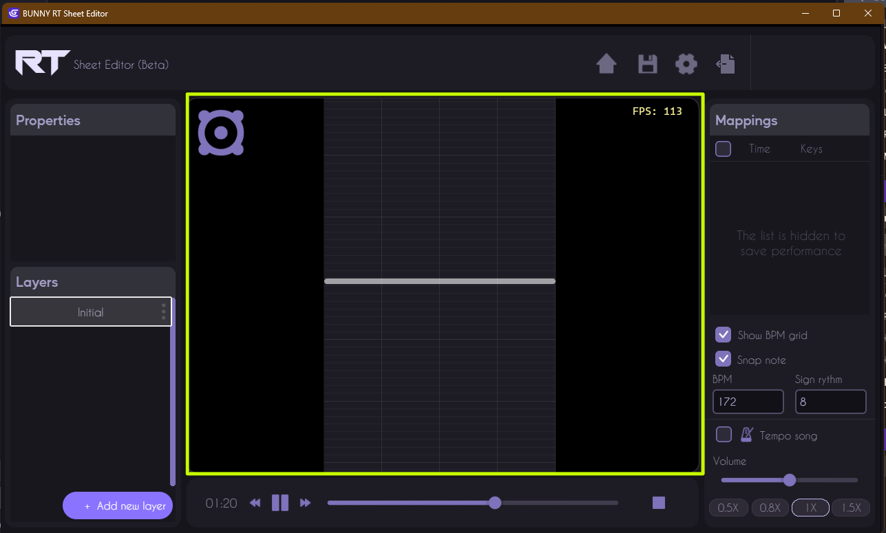
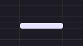
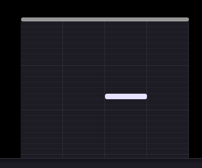
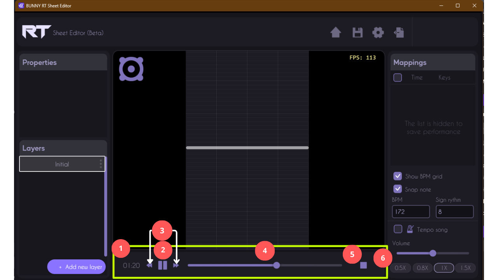
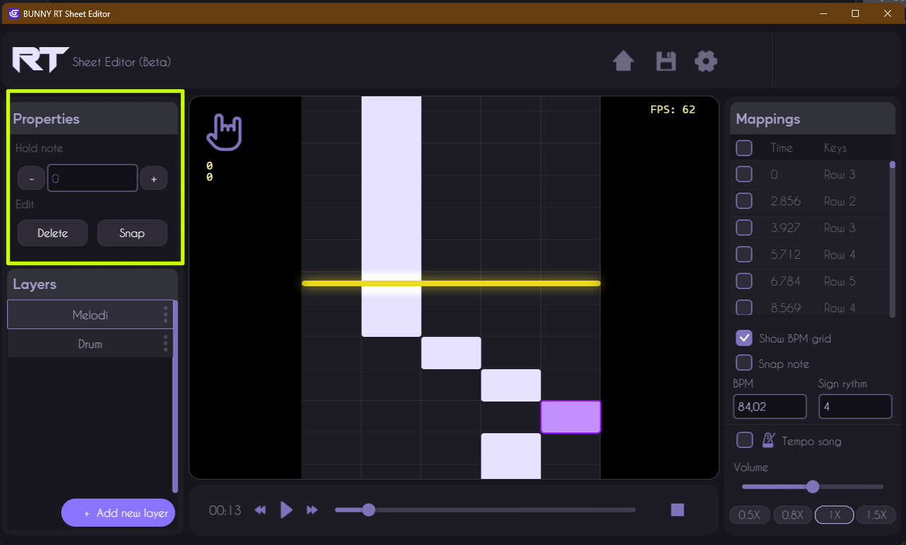
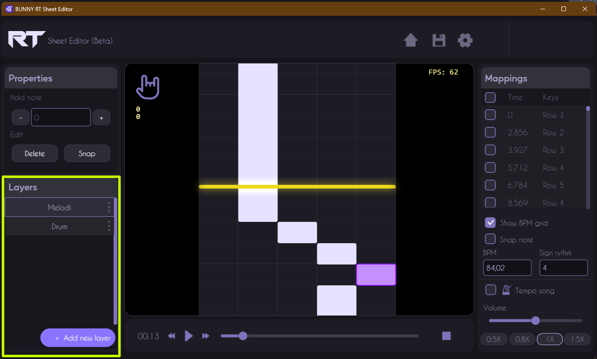
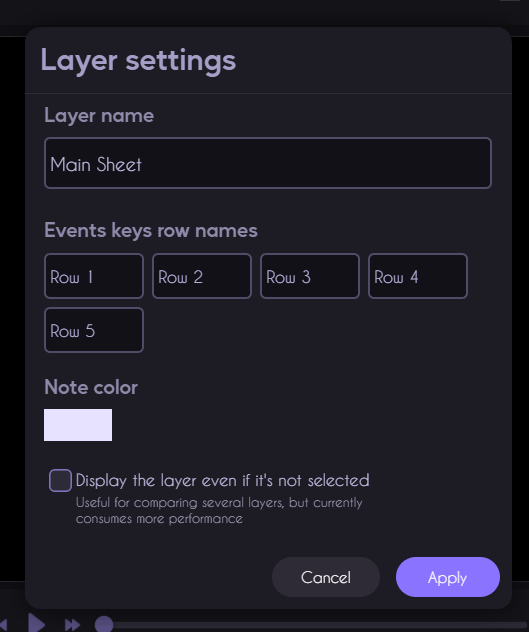
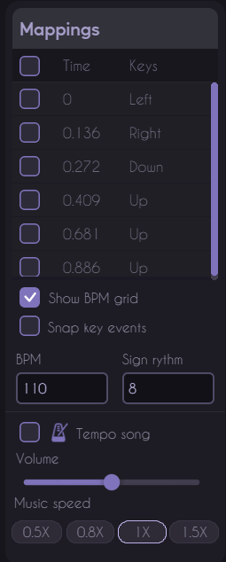

# Sheet editor page

## Top bar

The editor's top bar is designed to provide quick access to the tool's essential functions. 

### 1. Home
The "Home" icon takes you back to the main score editor screen. Click here for quick access to your dashboard and other projects without leaving the editor.

### 2. Save
The "Save" icon lets you save your progress at any time. Frequent saving is recommended to avoid data loss. Clicking on this icon saves your work in progress.

### 3. Settings
The "Settings" icon opens the configuration menu where you can adjust project parameters. 

### 4. Export
The "Export" icon lets you save your project in JSON formats compatible with various gaming platforms. Click here to export your finished project for sharing or integration into other game development software.

### 5. Undo/Redo
The arrow icons allow you to undo (Undo) or redo (Redo) the last actions performed in the editor. Use these buttons to quickly correct errors or return to an earlier version of your work. You can also use the usual keyboard shortcuts, Ctrl+Z to undo and Ctrl+LShift+Z to redo, to save time and work more efficiently.

## Workspace

This is the space for creating and modifying the tool's graphic elements.

It consists of :

### Event keys

Event keys are the tool's triggers. They are used to record the precise events you want to occur in your project and are currently organized in lines, named by default Line 1, Line 2 and so on. You can change the name of each row in the layer parameters.

### The rhythm sheet

This is the space where all  events key will be recorded. 

### Event keys line speawner

This is the line that graphically defines the position of the audio track, and is also the point at which event keys are created when the audio track is on play.

### BPM dancer

It's there to indicate whether the BPM you enter is consistent with the music on the audio track.

 

 

 

## Music track bar

The playback bar is used to control the playback of music and rhythm sequences.

 

Here are a few common functions that the playback bar contains:

### 1. Playback position

A visual indicator showing the current playback position in the track or sequence.

### 2. Play/Pause

 A button to start or stop music or rhythm sequence playback.

### 3. Fast Forward and Fast Rewind
 
Buttons for fast navigation within the track or sequence.

### 4. Playback slider

A visual indicator showing the current playback position in the track or sequence too.

### 5. Stop

A button to stop playback and return to the beginning of thetrack or sequence.

### 6. Playback Speed Control

Buttons to adjust playback speed, allowing you to slow down or speed up the music or rhythm sequence.

## Event keys properties

 

The Event Key Properties panel in Rhythm Sheet Editor is a tool that gives users precise control over the event keys in their projects. With this panel, users can view and modify the specific properties of selected event keys.

### 1. Hold note 
 
The note length setting field allows users to define the duration or length of the note associated with the selected event key. 

### 2. Edit Buttons

- The **“Delete”** button allows users to quickly delete the selected event key. 

- The **“Snap”** option allows users to control the precise alignment of event keys in relation to a grid or specific landmarks in the editor. 

## Layers

 

The Layer Panel in Rhythm Sheet Editor is an essential tool that enables users to manage and organize multiple event key chains in their projects.

### 1. Layer selection

Users can quickly select the layer they wish to work on, enabling them to view and modify layer-specific event keys.

### 2. Add new layer

This function allows users to add new layers to organize their event keys into logical or thematic groups. Users can create as many layers as they wish for flexible organization of their events.

### 3. Layer settings

 

**Change Layer Name:** Users can change the name of each layer for easy identification and efficient organization.

**Change Name of each Event Key Row:** Provides the ability to change the name of each row of event keys within a layer for better understanding and organization.

**Change Event Key Color:** Lets users customize the color of event keys in a layer for quick visual identification and distinction between events.

**Hide Layer:** Offers the option of hiding a layer to hide all associated events in the editor, simplifying the viewing and editing of other layers.

## Mappings list

 

### 1. Mapping list (Time & Keys)
The mapping list displays the times and keys associated with each event in the score. This section allows you to view and fine-tune the timing of notes and their corresponding keys.

### 2. Show BPM Grid" option
The "Show BPM Grid" checkbox lets you show or hide the beats-per-minute (BPM) grid in the main editing area. Showing this grid helps to visualize musical bars, making it easier to align notes with musical beats, ensuring better synchronization with the rhythm.

### 3. Snap Key Events" option
The "Snap Key Events" option enables or disables the automatic alignment of key events on the grid. This function helps ensure that notes are placed precisely on the defined beats, which is crucial for maintaining the rhythm and playability of rhythm playing.

### 4. BPM parameters
The BPM settings let you define the beats per minute of the music track. By setting the music's tempo, you can synchronize game events correctly with the musical rhythm.

### 5. Rhythm signature (Sign Rhythm)
The rhythm signature defines the rhythmic structure of the music. This helps to organize notes into appropriate measures, respecting the structure of the music and facilitating the creation of a coherent, well-structured score.

### 6. Tempo Song" option
The "Tempo Song" option synchronizes song playback speed with the set tempo. This ensures that song playback follows the tempo you set, allowing tempo adjustments without altering the pitch of the music.

### 7. Volume slider
The volume slider offers quick and easy control over the volume of the audio track.

### 8. Music speed options
The music speed buttons allow you to adjust the speed at which music is played (0.5X, 0.8X, 1X, 1.5X). Listening to music at different speeds is useful for checking the synchronization of notes with the rhythm, or for placing notes over fast music

