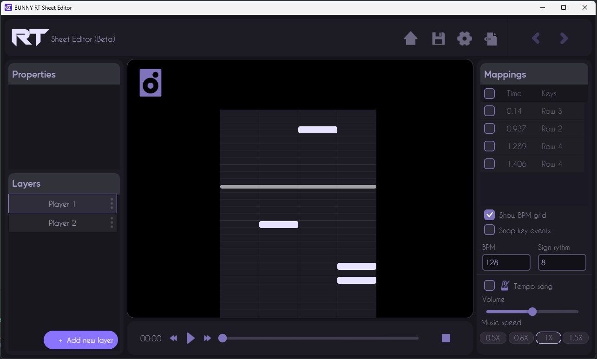

# What is RT Sheet Editor ?

Welcome to Rhythm Sheet Editor, the tool that helps you create rhythm games! Rhythm Sheet Editor is a cue-creation platform for rhythm game developers. It has been specially designed to handle a wide variety of situations and help develop the distinctive character of any rhythm game.

